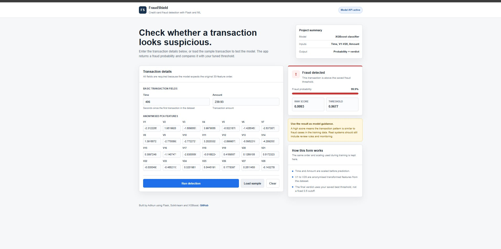

<div align="center">


# 🛡️ FraudShield

### End-to-End Data Science Project — Credit Card Fraud Detection

*From raw data to a live, deployed web app with a REST API — built end to end.*

**[🌐 Try the Live App](https://fraudshield-1vjs.onrender.com/)** &nbsp;·&nbsp; **[📂 View on GitHub](https://github.com/Adikun2007/CodTech-Project-3-End-To-End-Data-Science-Pipeline)**

</div>

---

## 🎯 Project Goal

> **Task:** Develop a full data science project — from data collection and preprocessing to model deployment using Flask.  
> **Deliverable:** A deployed API and web app showcasing the model's functionality.

FraudShield detects fraudulent credit card transactions in real time. You enter transaction details, hit **Run Detection**, and the app returns a fraud probability score plus a live verdict — powered by a tuned XGBoost model served through a Flask REST API, deployed on Render.

---

## 🖥️ Live Web App

> What you see when you open the app:



The app lets you:
- **Load a sample** real fraud transaction with one click
- **Run detection** and instantly see the fraud probability and verdict
- **See your threshold** — the model uses a precision-tuned threshold (0.9677), not the default 0.5

---

## 📊 Project Summary

| Detail | Value |
|---|---|
| Dataset | Kaggle Credit Card Fraud — 284,807 transactions |
| Fraud rate | ~0.17% (severely imbalanced) |
| Model | XGBoost Classifier |
| Imbalance fix | SMOTE oversampling |
| Best threshold | **0.9677** |
| API status endpoint | `/health` → `{"status": "ok"}` |
| Deployment | Render (live 24/7) |

---

## 🗂️ Project Structure

```
CodTech-Project-3-End-To-End-Data-Science-Pipeline/
│
├── main.py                    # Full data science pipeline (EDA → train → tune → save)
├── app.py                     # Flask web app + REST API
│
├── fraud_detection_model.pkl  # Trained XGBoost model
├── scaler.pkl                 # Fitted StandardScaler
├── best_threshold.pkl         # Tuned decision threshold (0.9677)
│
├── templates/
│   └── index.html             # Web UI
│
├── dashboard.png              # App screenshot
└── requirements.txt
```

---

## 🔁 Data Science Pipeline

```
1. DATA COLLECTION
   └── creditcard.csv (Kaggle) — 284,807 transactions, 30 features

2. EXPLORATORY DATA ANALYSIS
   └── Class distribution, null checks, feature correlation

3. PREPROCESSING
   ├── StandardScaler on Time and Amount
   └── SMOTE oversampling on training set only (no data leakage)

4. MODEL TRAINING
   ├── Train/test split — StratifiedKFold 80/20
   ├── XGBoost Classifier
   └── RandomizedSearchCV hyperparameter tuning

5. EVALUATION
   ├── Precision, Recall, F1, ROC-AUC
   └── Custom threshold tuning → best = 0.9677

6. DEPLOYMENT
   ├── Flask REST API (/predict, /health, /sample)
   ├── Interactive Web UI (templates/index.html)
   └── Deployed live on Render
```

---

## 📡 API Reference

**Base URL:** `https://fraudshield-1vjs.onrender.com`

---

### `GET /health` — Check API status

```bash
curl https://fraudshield-1vjs.onrender.com/health
```

```json
{
  "status": "ok",
  "threshold": 0.9677
}
```

---

### `POST /predict` — Run fraud detection

Send a transaction, get a verdict.

```bash
curl -X POST https://fraudshield-1vjs.onrender.com/predict \
  -H "Content-Type: application/json" \
  -d '{"Time": 406.0, "V1": -2.312, "V2": 1.951, "V3": -1.609, ..., "V28": -0.143, "Amount": 239.93}'
```

**Response:**
```json
{
  "fraud": true,
  "probability": 0.9993,
  "threshold_used": 0.9677,
  "verdict": "FRAUD DETECTED"
}
```

| Field | Description |
|---|---|
| `fraud` | `true` if probability ≥ threshold |
| `probability` | Raw fraud score (0–1) |
| `threshold_used` | Saved best threshold |
| `verdict` | `FRAUD DETECTED` or `LEGITIMATE` |

---

### `GET /sample` — Load a test transaction

Returns a real fraudulent transaction from the dataset — great for testing without manually entering values.

```bash
curl https://fraudshield-1vjs.onrender.com/sample
```

---

## 🚀 Run Locally

### 1. Clone the repo

```bash
git clone https://github.com/Adikun2007/CodTech-Project-3-End-To-End-Data-Science-Pipeline.git
cd CodTech-Project-3-End-To-End-Data-Science-Pipeline
```

### 2. Install dependencies

```bash
pip install -r requirements.txt
```

### 3. Download the dataset

Get `creditcard.csv` from Kaggle and place it in the project root:

> 📥 [Kaggle — Credit Card Fraud Detection Dataset](https://www.kaggle.com/datasets/mlg-ulb/creditcardfraud)
>
> *Sign in to Kaggle → go to the link → click Download → extract `creditcard.csv` into the project folder.*

### 4. Train the model

```bash
python main.py
```

Generates `fraud_detection_model.pkl`, `scaler.pkl`, and `best_threshold.pkl`.

### 5. Launch the app

```bash
python app.py
```

Open `http://localhost:5000` in your browser.

---

## 🧰 Tech Stack

| Layer | Tool |
|---|---|
| Language | Python 3.x |
| Data handling | pandas, numpy |
| ML model | XGBoost |
| Model utilities | scikit-learn (scaler, CV, metrics) |
| Imbalance handling | imbalanced-learn (SMOTE) |
| Artifact storage | joblib |
| Web framework | Flask |
| Frontend | HTML, CSS, JavaScript |
| Deployment | Render |

---

## ⚠️ Disclaimer

Built for educational purposes as part of a CodTech data science internship. Predictions from this model should not be used as the sole basis for any financial decisions. Production fraud systems require additional rule-based controls, human review, and continuous monitoring.

---

## 👤 Author

**Adikun** — [github.com/Adikun2007](https://github.com/Adikun2007)

*Built end-to-end with Python, Flask, scikit-learn, and XGBoost.*
